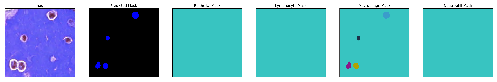
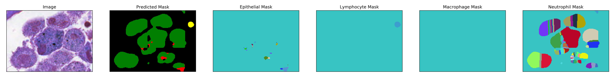
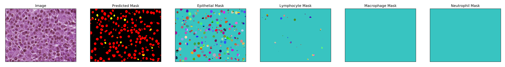
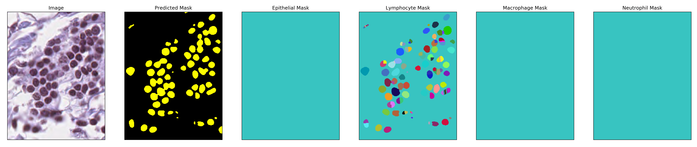
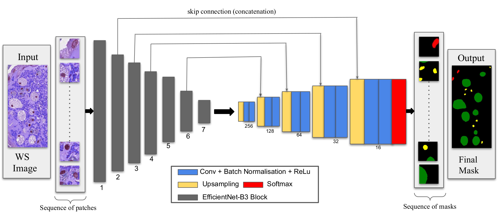

### *Fully Convolutional Networks for Instance Segmentation*

11th place solution to Multi-organ nuclei segmentation and classification challenge (MoNuSAC 2020) organised at ISBI 2020. 

The final submission scored an Average Panoptic Quality(PQ) of 0.1838 on the test set. Descirption of the method summarized in this [report](https://github.com/hasibzunair/MoNuSAC-ISBI-2020/blob/master/ISBI%202020%20MoNuSAC%20Workshop%20Challenge%20Paper.pdf). Details about the challenge at this [URL](https://monusac-2020.grand-challenge.org/Results/).

<p align="center">`
<a href="#"></a>
<a href="#"></a>
<a href="#"></a>
<a href="#"></a>
</p>

### Overview

In this work, we implement an end-to-end deep learning framework for automatic nuclei segmentation and classification from H&E stained whole slide images (WSI) of multiple organs (breast, kidney, lung and prostate). The proposed approach, called *PatchEUNet*, leverages a fully convolutional neural network of the U-Net family by replacing the encoder of the U-Net model with an EfficientNet architecture with weights initialized from ImageNet.

<p align="center">
<a href="#"></a>
</p>

Since there is a large scale variance in the whole slide images of the MoNuSAC 2020 Challenge, we propose to use a patchwise training scheme to mitigate the problems of multiple scales and limited training data. For the class imbalance problem, we design an objective function defined as a weighted sum of a focal loss and Jaccard distance, resulting in significantly improved performance. During inference, we apply the median filter on the predicted masks in an effort to refine the segmented outputs. Finally for each class mask, we apply watershed algorithm to get the class instances.

### Some preliminary results

Results reported in this table are from the validation set made from the entire training set provided for the challenge. These are results of multi-class segmentation of the 4 cell types. 

| Config  | IoU(%) | Dice(%) |
| ------  | ------ | ------  |
| U-Net  | 77  | 78 |
| Proposed | 84 | 87|

### Requirements
* Python: 3.6
* Tensorflow: 2.0.0
* Keras: 2.3.1
* [segmentation_models](https://segmentation-models.readthedocs.io/en/latest/install.html).
* OpenCV

### Environment installations

Run this command to make environment

```
conda env create -f environment.yml
```

*OR* you can make you own environment by:

```
conda create -n yourenvname python=3.6 anaconda
```

Then install the packages

```
conda install -c anaconda tensorflow-gpu=2.0.0
conda install -c conda-forge keras
conda install -c conda-forge opencv
conda install -c conda-forge tqdm
```

The run `conda activate yourenvname`.

NOTE: `segmentation_models` does not have conda distribution. You can install by running `pip install -U --pre segmentation-models --user` inside your environment. More details at [segmentation_models](https://segmentation-models.readthedocs.io/en/latest/install.html).

### Dataset versions

* `MoNuSAC_images_and_annotations` : original dataset which has patient's whole slide images (WSI) and ground truth. (Given by challenge organizers)
* `MoNuSAC_masks` : contains binary masks generated from `get_mask.ipynb`.
* `Testing Images`: contains test images, without annotations. (Given by challenge organizers)
* `data_processedv0` : contains all raw images and the ground truth masks.
* `data_processedv4` : sliding window patchwise data from original images and masks in `data_processedv0`.
* `data_processedv5` : 80/20 trainval split from `data_processedv4`.

### Getting started

0. Clone repository (obviously!)
1. Make `dataset` folder
2. Put `MoNuSAC_images_and_annotations` in `dataset` folder
3. Run `0_get_masks.ipynb`. You should get the MoNuSAC_masks folder in dataset
4. Run `1_data_process_MoNuSAC.ipynb` to get raw images and their ground truth masks in `data_processedv0`. 
5. Run `2_extract_patches.ipynb` to get patches of images and gt masks from the previous raw version to get `data_processedv4` and the 80/20 split `data_processedv5`.
6. Run `3_train.iynb`. It trains *PatchEUNet* on `data_processedv5`.
7. Put `Testing Images` in `dataset` folder.
8. Run `3c_load_test_data.ipynb`. Outputs `test_images` folder with all test images.
8. Run `4_inference.ipynb` to get final prediction masks from `test_images`. (For visualization)
9. Run `4b_inference.ipynb` to get final prediction masks according to MoNuSAC submission format.


### Model

Weight file for the multiclass segmentation model is available at [releases](https://github.com/hasibzunair/MoNuSAC-ISBI-2020/releases/tag/v0.0.1). 

### Acknowledgements 

Model definition and baseline training scripts are based on https://segmentation-models.readthedocs.io/en/latest/install.html.

### License
Your driver's license.
